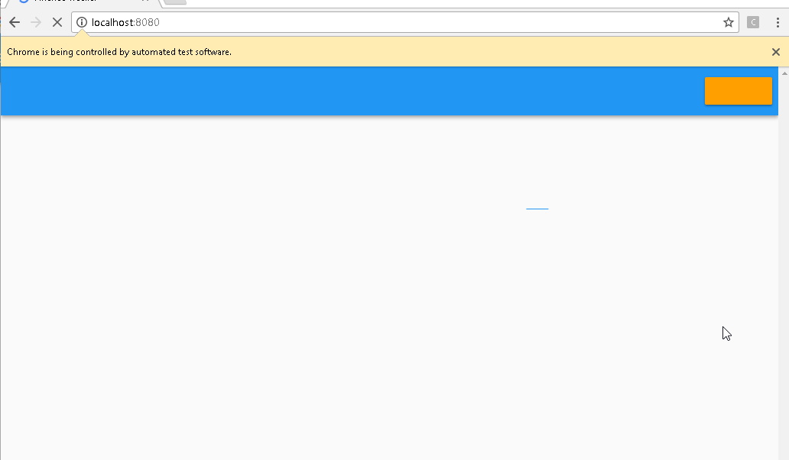

# Assignment 2 - Automated development process.

Name: Joe Wemyss

Student No.:  20068336

## Overview.

This application is a Progressive Web Application that functions in a "serverless" fashion. It communicates directly with
 a database from the client. The application is built using [VueJS](https://vuejs.org), with firebase and Google Cloud Platform as a backend.
## Environment.

This project requires NodeJS to be installed. I built it using Node 8.6.0, and NPM 5.3.0, but any version greater than 4.0.0 should work. There is no need for any database software to be installed, however, you will need a `.env` file located in the root of the project directory that contains the following env variables;

```
  FIREBASE_API_KEY=<your value>
  FIREBASE_AUTH_DOMAIN=<your value>
  FIREBASE_DATABASE_URL=<your value>
  FIREBASE_PROJECT_ID=<your value>
  FIREBASE_STORAGE_BUCKET=<your value>
  FIREBASE_MESSAGING_SENDER_ID=<your value>
  BACKEND_BASE_URL=<your value>
  MAPS_API_KEY=<your value>
  LOG_LEVEL=trace
  COVERALLS_REPO_TOKEN=<your value>
``` 

## Build automation.

To build the application for development, with Live Reload and HotModuleReplacement(HMR), run `npm run dev`.

To build the application for production, run `npm run build`. This will build the application in a production ready format, with full minification, a production-ready Service Worker and compressed images.

To run the full test suite, you can run `npm test`. This will run the full unit test suite, as well as the acceptance tests. 
## Acceptance Testing.

Due to time constraints, and some technical issues with using Nightwatch, I was only able to include two Acceptance tests. Both are included in the same file (which can be found [here](https://github.com/JavaTheNutt/web_app_dev_project_frontend_02/blob/master/test/e2e/specs/test.js)). There is a third test which is commented out. This test also works, but I couldn't get the two to work together, as I was unable to force Firebase to log out between tests. 

### Test 01 -- Checking the page title.
This was the first test I wrote and it simply checks that the page title is as expected. I didn't include a screenshot for this, as there was not really anything to see. The output of this test can bbe seen below:

```
  Running:  open page
   √ Element <#app> was visible after 91 milliseconds.
   √ Testing if the page title equals "Finance Tracker".
  
  OK. 2 assertions passed. (19.356s)

```

### Test 02 -- Creating an account
This test ran through the basic sign up process. I have included an animated GIF of the test running.
```
  Running:  sign up
   √ Element <#app> was visible after 128 milliseconds.
   √ Element <button[name=loginButton]> was visible after 93 milliseconds.
   √ Element <input[name=emailField]> was visible after 187 milliseconds.
   √ Element <input[name=passwordField]> was visible after 107 milliseconds.
   √ Element <input[name=confirmPasswordField]> was visible after 217 milliseconds.
   √ Testing if element <#profileHeader> contains text: "Welcome to your Profile page, unknown".
  
  OK. 6 assertions passed. (21.109s)
```


## Continuous Integration.

The URL for the travis project can be found [here](https://travis-ci.org/JavaTheNutt/web_app_dev_project_frontend_02). In order to build this application yourself, you will need to create a firebase account, copy the keys to a `.env` file located at the project root for development, and also copy the keys to the Travis environment variables. You will also need to create a Facebook developer account, and link copy your client secret key to your firebase project. As Firebase is a subsidiary of Google, there is no need to obtain a Google client secret key for Google OAuth.

## Automated Deployment.

The hosted application can be found [here](https://finance-tracker-1cc05.firebaseapp.com/). In order to facilitate automated deployment, the steps outliend in the travis step above will need to be completed.

## Extra features.

This project is unit tested using the [karma test runner](https://karma-runner.github.io/1.0/index.html). This primarily uses [PhantomJS](http://phantomjs.org/) for headless browser tests, but it can also run the tests on any browser that the user has on their device, to ensure cross platform compatability.

This projects end-to-end test suite is powered by [NightwatchJS](http://nightwatchjs.org/), which runs on top of the [Selenium Web Driver](http://www.seleniumhq.org/).

This project also has two seperate build pipelines, one for the [Client](https://travis-ci.org/JavaTheNutt/web_app_dev_project_frontend_02) and one for the [REST API](https://travis-ci.org/JavaTheNutt/web_app_dev_project_backend). 
